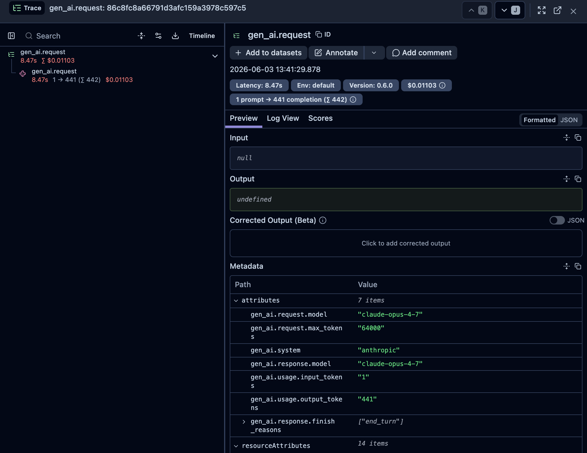

# yallmap


An OpenTelemetry-instrumented gateway for Anthropic-compatible LLMs. Drop it in front
of [Claude Code](https://claude.ai/code) or any Anthropic SDK client to get per-request
token tracking, cost attribution, and latency observability in
[Langfuse](https://langfuse.com) — no client changes required.

## Why this exists

LiteLLM, Helicone, and Portkey are already out there, making this Yet Another LLM Proxy (YALLMAP). This is a different point in the design space: TypeScript-native, Anthropic API-first (not OpenAI-shaped), with routing rules expressed as typed functions instead of YAML or CEL. Built around Claude Code as a primary client, optimized for streaming and tool-use.  It's the LLM proxy that I need, so I've built it and shared it, as I can't be the only one who works the way I do.

## Try it in 2 minutes (if you have Claude Code installed)

```bash
git clone https://github.com/kckempf/yallmap && cd yallmap
npm install
npm run dev                          # starts on :3001

# in another shell:
ANTHROPIC_BASE_URL=http://localhost:3001 claude
```

Langfuse is **optional** — the gateway works without it; you just lose the telemetry
half. The telemetry exporter warns on startup if `OTEL_EXPORTER_OTLP_ENDPOINT` is unset,
then continues running normally.

## Status

**v0.8** — Production hardening. See roadmap below.

## How it works

```text
Claude Code ──► yallmap :3001 ──► api.anthropic.com
                     │          └───► Ollama (ollama/* models)
                     │
                     └──► Langfuse (via OTLP)
                          gen_ai.system
                          gen_ai.request.model
                          gen_ai.usage.input_tokens
                          gen_ai.usage.output_tokens
                          gen_ai.response.finish_reasons
```

Every request to `POST /v1/messages` is routed to the appropriate provider based on
TypeScript routing rules. SSE streaming is piped through without buffering. A transform
stream reads SSE events in-flight to extract token usage, emitted as a `gen_ai.request`
span when the response completes.

Ollama requests are automatically translated between the Anthropic Messages API format
and Ollama's OpenAI-compatible API — the client always speaks Anthropic.

## Prerequisites

- Node.js 20+
- A running [Langfuse](https://langfuse.com/docs/deployment/self-host) instance
  (Docker Compose quickstart: `docker-compose up -d` from the Langfuse repo)
- [Ollama](https://ollama.ai) (optional — only needed for `ollama/*` model routing)

## Setup

```bash
npm install
cp .env.example .env
```

Edit `.env`:

```env
# Assuming Langfuse is running on port 3000
PORT=3001

# Langfuse OTLP endpoint
OTEL_EXPORTER_OTLP_ENDPOINT=http://localhost:3000/api/public/otel/v1/traces

# Langfuse project keys (Settings → API Keys)
LANGFUSE_PUBLIC_KEY=pk-lf-...
LANGFUSE_SECRET_KEY=sk-lf-...

# Optional overrides (defaults shown)
# ANTHROPIC_BASE_URL=https://api.anthropic.com
# OLLAMA_BASE_URL=http://localhost:11434
```

## Running

```bash
# Development (watch mode, loads .env)
npm run dev

# Production
npm run build
npm start
```

## Pointing Claude Code at the gateway

```bash
ANTHROPIC_BASE_URL=http://localhost:3001 claude
```

Or export it in your shell profile to make it permanent.

## Authentication

The gateway supports a multi-key allowlist with per-key identity. Configure clients
via the `GATEWAY_API_KEYS` environment variable as comma-separated `label:secret`
pairs:

```env
GATEWAY_API_KEYS=alice:abc123,bob:def456,ci:ghj789
```

Clients send their secret in the `x-gateway-key` header (separate from Anthropic's
`x-api-key`, which is forwarded upstream untouched):

```bash
curl -X POST http://localhost:3001/v1/messages \
  -H 'x-gateway-key: abc123' \
  -H "x-api-key: $ANTHROPIC_API_KEY" \
  -H 'anthropic-version: 2023-06-01' \
  -H 'content-type: application/json' \
  -d '{"model":"claude-sonnet-4-6","max_tokens":100,"messages":[{"role":"user","content":"hi"}]}'
```

From the Anthropic SDK, pass the header via `defaultHeaders`:

```typescript
import Anthropic from '@anthropic-ai/sdk';

const client = new Anthropic({
  baseURL: 'http://localhost:3001',
  defaultHeaders: { 'x-gateway-key': process.env.GATEWAY_KEY },
});
```

The authenticated `keyId` (the label half of the pair) propagates downstream:

- **Request logs** — appears as `keyId` in the structured JSON log line.
- **Rate limiting** — the default `rateLimit` keys on `keyId` when set.
- **Langfuse traces** — emitted as the `user.id` span attribute, surfaced as the
  user filter in the Langfuse UI.

When `GATEWAY_API_KEYS` is unset, the gateway runs **unauthenticated**. This keeps
the 60-second quickstart frictionless but is unsafe for any deployment with a
public endpoint. A warning is logged on startup if `NODE_ENV=production` and no
keys are configured.

## Middleware

Middleware runs before every upstream call. It can inspect or modify the request, reject
it early, or observe the response. Middleware is configured in `src/middleware/config.ts`.

```typescript
import { costGuard, rateLimit, piiRedactor } from './index';

export const middlewares: MiddlewareFn[] = [
  costGuard(0.10),                              // reject if worst-case cost > $0.10
  rateLimit({ requests: 100, windowMs: 60_000 }),  // 100 req/min per API key
  piiRedactor([/\b\d{3}-\d{2}-\d{4}\b/g]),     // redact SSNs from messages
];
```

### Built-in middleware

| Factory | Description |
| --- | --- |
| `costGuard(limitUsd)` | Rejects with 429 when worst-case cost (model × max_tokens) exceeds `limitUsd`. Uses the built-in pricing table; unknown models pass through. |
| `apiKeyAuth({ keys, headerName? })` | Allowlist authentication. Rejects with 401 if `x-gateway-key` is missing or unknown. On success, sets `ctx.auth.keyId` for downstream middleware. See [Authentication](#authentication). |
| `rateLimit({ requests, windowMs, keyFn? })` | In-memory fixed-window counter. Keys on `ctx.auth.keyId` when present, otherwise `x-api-key`. Override with `keyFn`. **State is per-process and resets on restart — do not deploy behind a load balancer without a shared store.** |
| `piiRedactor(patterns, replacement?)` | Regex-replaces matches in message `text` content blocks before forwarding. |

### Writing custom middleware

Middleware is a `(ctx, next) => Promise<Response>` function:

```typescript
import type { MiddlewareFn } from './types';

const myMiddleware: MiddlewareFn = async (ctx, next) => {
  // inspect: ctx.model, ctx.maxTokens, ctx.body, ctx.clientHeaders
  if (ctx.model.startsWith('claude-opus')) {
    return new Response(JSON.stringify({ type: 'error', error: { type: 'forbidden', message: 'Opus not allowed' } }), {
      status: 403, headers: { 'content-type': 'application/json' },
    });
  }
  return next();  // or: const res = await next(); then inspect res
};
```

## Routing

Routing rules live in `src/routing/config.ts`. Rules are TypeScript functions —
no YAML, no DSL.

```typescript
import { firstMatch, whenModel, chain, anthropic, ollama } from './index';

export const router = firstMatch([
  // Route ollama/* models to local Ollama, fall back to Anthropic if unavailable
  whenModel(/^ollama\//i, chain(ollama, anthropic)),
]);
```

### Helpers

| Helper | Description |
| --- | --- |
| `whenModel(pattern, provider)` | Match on model name (string or regex) |
| `chain(p1, p2, ...)` | Try providers left-to-right; fall back on 5xx or network error |
| `firstMatch(rules, fallback?)` | Evaluate rules top-to-bottom; first match wins |

### Fallback behaviour

When a provider list is returned (via `chain`), the proxy tries each in order:

- **429 / 503 / 529** — retry the same provider with exponential backoff (see [Retries](#retries))
- **Other 5xx** — drain the body, try the next provider immediately
- **Network error** — try the next provider immediately
- **4xx** — forward to the client immediately (no retry)
- **All providers exhausted** — return 502

## Agent sessions

When an agent makes many LLM calls in a loop, the gateway can correlate them into a
single session in Langfuse using either of two mechanisms:

### `x-session-id` header — simple loops

Set the same UUID on every call in an agent run. The gateway attaches it as a `session.id` span attribute (standard OTel; also recognised
by Langfuse) and strips the header before forwarding to upstream.

```typescript
import Anthropic from '@anthropic-ai/sdk';
import { randomUUID } from 'crypto';

const client = new Anthropic({ baseURL: 'http://localhost:3001' });
const sessionId = randomUUID();

for (const step of agentSteps) {
  await client.messages.create(step, {
    headers: { 'x-session-id': sessionId },
  });
}
```

### W3C `traceparent` — OTel-instrumented frameworks

If your agent framework (LangChain, CrewAI, custom OTel setup) propagates W3C trace
context, the gateway automatically nests its `gen_ai.request` spans as children of the
incoming trace. No code changes needed on the client side.

## Retries

The proxy retries 429 (rate limited), 503 (service unavailable), and 529 (Anthropic
overloaded) on the same provider before falling back to the next one.

**Backoff**: full jitter — `random(0, baseDelay × 2^attempt)`. If the upstream sends a
`Retry-After` header (≤ 60 s), that value is used instead.

**Environment variables:**

| Variable | Default | Description |
| --- | --- | --- |
| `MAX_RETRIES` | `3` | Per-provider retry attempts |
| `RETRY_BASE_DELAY_MS` | `1000` | Base delay for backoff (ms) |

## Upstream timeouts

The gateway uses [`undici`](https://github.com/nodejs/undici) for upstream calls.
Two granular timeouts cap how long we wait for an upstream provider. Both also
respond to per-request `AbortSignal` cancellation, so a client disconnect cancels
the upstream call in flight.

| Variable | Default | Description |
| --- | --- | --- |
| `UPSTREAM_HEADERS_TIMEOUT_MS` | `30000` | Time to wait for the first response byte (ms). Mirrors undici's `headersTimeout`. |
| `UPSTREAM_BODY_TIMEOUT_MS` | `300000` | Time to wait for the full response body (ms). Mirrors undici's `bodyTimeout`. |

## Graceful shutdown

On `SIGTERM` or `SIGINT` the gateway:

1. Aborts in-flight upstream calls (the per-request `AbortSignal` is chained to a
   process-wide shutdown signal).
2. Stops accepting new connections via `server.close()`.
3. If `server.close()` hasn't returned within `SHUTDOWN_TIMEOUT_MS`, forces sockets
   shut with `server.closeAllConnections()`.
4. Flushes the OpenTelemetry SDK so trailing spans reach Langfuse.
5. Exits.

The default 25 s timeout stays under ECS's 30 s `SIGKILL` window so the orchestrator
sees a clean exit during rolling deploys.

| Variable | Default | Description |
| --- | --- | --- |
| `SHUTDOWN_TIMEOUT_MS` | `25000` | Max drain time before sockets are force-closed (ms). |

## Logging

Request logs are written as structured JSON to stdout — compatible with CloudWatch,
Datadog, or any log aggregation tool.

```json
{"level":30,"time":1748470913,"requestId":"a3f7b912","method":"POST","path":"/v1/messages",
 "status":200,"latencyMs":487,"model":"claude-sonnet-4-6","provider":"anthropic",
 "inputTokens":343,"outputTokens":13,"costUsd":0.000224}
```

In development (`NODE_ENV=development`), set `LOG_LEVEL=debug` and logs are formatted
with `pino-pretty` for readability.

**Environment variables:**

| Variable | Default | Description |
| --- | --- | --- |
| `LOG_LEVEL` | `info` | `trace` \| `debug` \| `info` \| `warn` \| `error` \| `fatal` |
| `CAPTURE_CONTENT` | _(unset)_ | Set to `true` to record prompt and completion in Langfuse traces (`gen_ai.prompt` / `gen_ai.completion` span attributes). Off by default — message content stays out of telemetry. |

## Cost tracking

The `gen_ai.usage.cost_usd` span attribute is set on every non-streaming response where
the model is in the pricing table. Cost also appears in the request log as `costUsd`.

Pricing data lives in `src/pricing/anthropic.ts` (auto-generated). To refresh it:

```bash
npm run update-pricing
```

The script fetches the [LiteLLM community pricing registry](https://github.com/BerriAI/litellm/blob/main/model_prices_and_context_window.json),
validates the schema, prints a human-readable diff, and regenerates the file. It exits
non-zero if the upstream schema changes in a breaking way, so CI fails loudly.

A GitHub Actions workflow (`.github/workflows/update-pricing.yml`) runs this every
Monday and opens a PR when prices change.

## What you see in Langfuse



Each request produces a `gen_ai.request` span with:

| Attribute | Example |
| --- | --- |
| `gen_ai.system` | `anthropic` or `ollama` |
| `gen_ai.request.model` | `claude-sonnet-4-6` |
| `gen_ai.request.max_tokens` | `32000` |
| `gen_ai.response.model` | `claude-sonnet-4-6` |
| `gen_ai.usage.input_tokens` | `343` |
| `gen_ai.usage.output_tokens` | `13` |
| `gen_ai.usage.cost_usd` | `0.000224` |
| `gen_ai.response.finish_reasons` | `["end_turn"]` |
| `gen_ai.prompt` | `[{"role":"user","content":"Hello"}]` _(opt-in: `CAPTURE_CONTENT=true`)_ |
| `gen_ai.completion` | `[{"type":"text","text":"Hi there"}]` _(opt-in: `CAPTURE_CONTENT=true`)_ |

`gen_ai.system` reflects the provider that actually handled the request — useful for
distinguishing local vs. cloud inference in Langfuse dashboards.

## Docker

```bash
docker build -t yallmap .
docker run -p 3001:3001 \
  -e OTEL_EXPORTER_OTLP_ENDPOINT=http://host.docker.internal:3000/api/public/otel/v1/traces \
  -e LANGFUSE_PUBLIC_KEY=pk-lf-... \
  -e LANGFUSE_SECRET_KEY=sk-lf-... \
  yallmap
```

The multi-stage Dockerfile builds in `node:22-alpine`, copies only compiled output into
the final image. No dev dependencies or TypeScript source in the production image.

For AWS deployment, see the companion CDK construct:
[cdk-yallmap](https://github.com/kevinkempf/cdk-yallmap).

## Adding a provider

Implement `ProviderAdapter` from `src/adapters/types.ts`:

```typescript
// src/adapters/my-provider.ts
import type { ProviderAdapter } from './types';

export const myProviderAdapter: ProviderAdapter = {
  path: '/v1/chat/completions',           // upstream path
  translateRequest: (body) => { /* ... */ return translated; },
  translateResponse: (body) => { /* ... */ return translated; },
  createStreamTranslator: () => new MyStreamTransform(),
};
```

Then add a `Provider` entry in `src/routing/index.ts` and reference it in
`src/routing/config.ts`. The existing Ollama adapter is the reference implementation.

## Design decisions

**Provider adapters as a formal interface.** `ProviderAdapter` defines the three
translation surfaces — request body, response body, SSE stream — so new providers are
drop-in files with no changes to the router or proxy. The `anthropicAdapter` is an
identity pass-through; the `ollamaAdapter` is the reference implementation of a full
translation.

**Routing policies as TypeScript functions.** Rules are typed predicates — `whenModel`,
`chain`, `firstMatch`. No YAML DSL, no CEL expressions. Adding a rule is adding a line
of code with full type safety and IDE autocomplete.

**Anthropic API surface preserved end-to-end.** Ollama uses an OpenAI-compatible API;
the gateway translates requests and responses transparently so all clients speak the
Anthropic Messages API regardless of which provider handles the request.

**SSE never buffered.** The streaming response is piped through a Transform stream that
reads events in-flight. The client receives bytes as they arrive; nothing is held in
memory waiting for the response to complete.

**OTel Gen AI semantic conventions.** Spans use the
[`gen_ai.*` attribute namespace](https://opentelemetry.io/docs/specs/semconv/gen-ai/)
so traces are interoperable with any OTel-compatible backend, not just Langfuse.

**`accept-encoding: identity` enforced upstream.** Compressed responses can't be parsed
for telemetry. The gateway requests uncompressed from upstream and forwards uncompressed
to the client.

**Middleware as a compile-time chain.** Middleware is a list of typed
`(ctx, next) => Promise<Response>` functions composed at startup. Each function either
calls `next()` to continue or returns its own Response to short-circuit. This keeps the
proxy loop clean — policy decisions (cost guards, rate limiting, PII redaction) live
outside the retry/fallback logic and are trivially testable in isolation.

## Roadmap

- [x] v0.1 — transparent Anthropic proxy + OTel observability
- [x] v0.2 — TypeScript routing policies, Ollama adapter, fallback chains
- [x] v0.3 — cost tracking, exponential retry with backoff, structured pino logging
- [x] v0.4 — CDK construct for ECS Fargate deployment ([cdk-yallmap](https://github.com/kevinkempf/cdk-yallmap))
- [x] v0.5 — formalized `ProviderAdapter` interface; drop-in provider plugins; agent session groundwork (`x-session-id`, W3C trace context)
- [x] v0.6 — compile-time middleware chain (`costGuard`, `rateLimit`, `piiRedactor`; custom middleware support); opt-in content capture (`CAPTURE_CONTENT`)
- [x] v0.7 — multi-key auth (`apiKeyAuth`) with identity propagation to rate limit, logs, and Langfuse `user.id`; request body-size limit; clamped `Retry-After` + equal-jitter backoff; OSS publication scaffolding (LICENSE, CONTRIBUTING, CI, Dependabot)
- [x] v0.8 — production hardening: streaming body-size cap, configurable upstream timeouts + per-request `AbortSignal`, graceful HTTP shutdown
- [ ] v0.9 — TBD (candidates: persistent rate-limit state, per-key cost budgets, Prometheus `/metrics`)

## License

MIT
